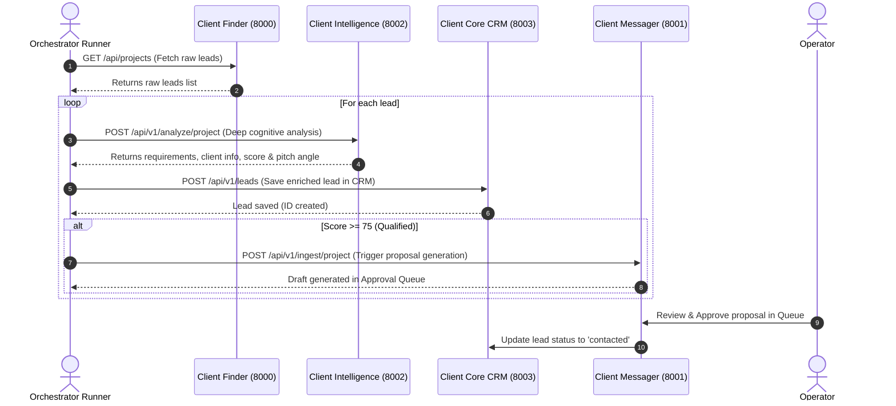

# Architecture & Workflow Orchestration Reference
## Client Orchestrator Service (`CLIENT-ORCHESTRATOR-SVC`)

---

## 1. Role & System Responsibility
The **Client Orchestrator Service (`CLIENT-ORCHESTRATOR-SVC`)** (Port 8004) is the central conductor that automates the end-to-end client acquisition lifecycle across all microservices:

1. **Pipeline Runner**: Coordinates the multi-service flow:
   - Queries `CLIENT-FINDER-SVC` (8000) for new discovered gigs
   - Sends leads to `CLIENT-INTELLIGENCE-SVC` (8002) for deep enrichment & scoring
   - Persists leads into `CLIENT-CORE-SVC` (8003)
   - Forwards qualified leads ($\ge 75$) to `CLIENT-MESSAGER-SVC` (8001) for proposal drafting
2. **Platform Topology & Service Discovery**: Real-time heartbeat monitoring of all 5 platform services.
3. **Event Bus**: Event publisher & subscriber for domain transitions.
4. **Execution Audit Log**: Persistent database records of every pipeline run and step-by-step trace.

---

## 2. End-to-End Orchestrated Pipeline Flow

